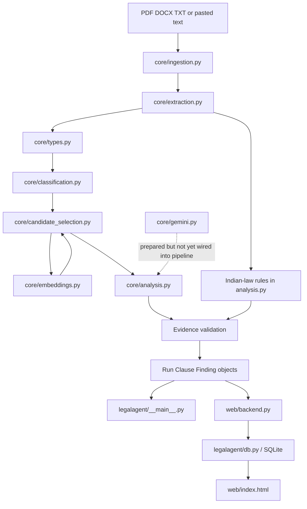
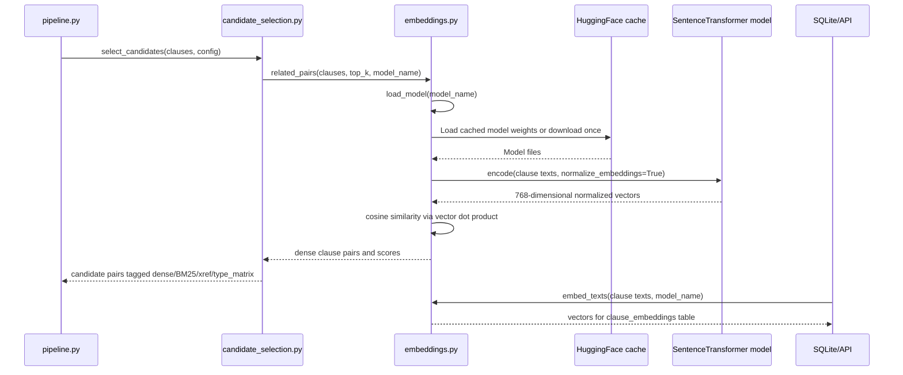

# LegalAgent Architecture and File Flow

Date: 2026-09-20

This is a manual review guide for the current prototype. It explains which file owns each responsibility and how a contract moves through the system.

## 1. End-to-End Flow



The product checks two things:

1. Clause-to-clause relationships: conflicts, dependencies, overlaps, and ambiguity.
2. Clause-to-Indian-law relationships: statutory or enforceability risks.

## 2. Entry Points

### `legalagent/__main__.py`

The CLI entry point:

```bash
venv/bin/python -m legalagent analyse path/to/contract.pdf --output runs/result.json
```

It parses arguments, calls `legalagent.core.pipeline.analyse()`, and serializes the returned `Run` and `Finding` objects.

### `web/server.py`

Starts Uvicorn and serves the FastAPI app:

```bash
venv/bin/python web/server.py
```

### `web/backend.py`

Provides the browser API:

- `GET /api/contracts`
- `GET /api/contracts/{contract_id}`
- `POST /api/contracts/analyze`
- `GET /api/contracts/{contract_id}/embeddings`
- `GET /api/export/{contract_id}`

It also loads `.env` using `python-dotenv`, initializes SQLite, and serves the landing page and dashboard.

Current gap: the custom web endpoint still has its original heuristic analysis path. It should eventually call the same core pipeline as the CLI.

## 3. Core Pipeline Reading Order

### A. Ingestion: `legalagent/core/ingestion.py`

Main functions:

- `pdf_to_markdown(file_path, use_ocr=True)`
- `ingest(file_path)`
- `normalize(text)`

PDF behavior:

1. Open PDF with PyMuPDF.
2. Extract native text and layout blocks.
3. If a page has very little native text, call PyMuPDF's `get_textpage_ocr()` using Tesseract.
4. Emit page-separated Markdown-like text.
5. Remove Markdown headings/page comments before analysis.
6. Normalize whitespace, page numbers, repeating headers, and hyphenated line breaks.

The returned normalized text is canonical. Every later evidence offset must refer to it.

Utility: `scripts/pdf_to_markdown.py` saves a Markdown extraction for manual review.

### B. Clause extraction: `legalagent/core/extraction.py`

Main function: `extract(text, contract_id)`

It:

- Detects numbered clauses such as `1.1`, `5.2`, and `12.3`.
- Creates `Clause` objects with text, heading, ordinal, and character offsets.
- Finds references such as `Section 8.2` and `Clause 1.1`.
- Resolves references to known clauses.
- Adds occurrence suffixes when source documents repeat section numbers.

### C. Shared data contracts: `legalagent/core/types.py`

- `Clause`: one extracted contract provision.
- `Finding`: one risk or relationship result.
- `Run`: one analysis execution and its statistics.

`Finding.evidence` stores clause offsets, while `Finding.refs` stores legal source metadata.

### D. Classification: `legalagent/core/classification.py`

`classify(clauses)` applies the current transparent keyword baseline. Labels include:

- `indemnification`
- `limitation_of_liability`
- `termination`
- `survival`
- `confidentiality`
- `governing_law`
- `assignment`
- `warranty`
- `payment`

The classifier does not make a legal decision. It produces labels for retrieval and rules.

## 4. InLegal-SBERT Loading and Calling Flow

File: `legalagent/core/embeddings.py`

Default model:

```text
bhavyagiri/InLegal-Sbert
```

This is the exact runtime flow:



### `load_model(model_name)`

```python
@lru_cache(maxsize=2)
def load_model(model_name="bhavyagiri/InLegal-Sbert"):
    from sentence_transformers import SentenceTransformer
    return SentenceTransformer(model_name)
```

Important behavior:

- The import is lazy, so importing the application does not immediately load a large model.
- `@lru_cache(maxsize=2)` keeps the loaded model in memory and prevents repeated loading.
- The first call uses the local Hugging Face cache when weights are already present; otherwise Sentence Transformers downloads them.
- A second model can be cached, which allows later BM25/dense model comparisons.

### `embed_texts(texts, model_name)`

Used by the web embedding endpoint:

```python
vectors = load_model(model_name).encode(
    texts,
    normalize_embeddings=True,
)
```

The result is converted to a NumPy `float32` array. InLegal-SBERT currently produces 768 dimensions.

### `related_pairs(clauses, top_k, model_name)`

Used by dense or hybrid candidate selection:

1. Extract each clause's text.
2. Encode all texts with normalized embeddings.
3. Compute the similarity matrix with:

```python
scores = vectors @ vectors.T
```

Because vectors are normalized, this dot product is cosine similarity.

4. Ignore the clause itself.
5. Keep the top `top_k` other clauses for each clause.
6. Return `(clause_a_id, clause_b_id, score)` tuples.

### Where SBERT is called

`legalagent/core/candidate_selection.py` calls it only when:

```python
config["retrieval_method"] in {"dense", "hybrid"}
```

The call is:

```python
from legalagent.core.embeddings import related_pairs

for clause_a_id, clause_b_id, score in related_pairs(
    clauses,
    top_k=k,
    model_name=config.get("embedding_model", "bhavyagiri/InLegal-Sbert"),
):
    add_pair(clause_a_id, clause_b_id, "dense")
```

BM25, cross-references, and type-matrix pairs are retained alongside dense pairs. Type-matrix and xref pairs have priority when the candidate cap is applied.

### Where embeddings are stored

`web/backend.py` calls `embed_texts()` in:

```text
GET /api/contracts/{contract_id}/embeddings
```

The generated vectors are written by `legalagent/db.py` into `clause_embeddings`:

- `clause_id`
- `contract_id`
- `model_name`
- `dimension`
- `vector_json`
- `created_at`

The endpoint also calculates a 2D SVD projection for the dashboard embedding graph. The projection is for visualization; retrieval uses the full vector.

### How to manually test SBERT

```bash
venv/bin/python -c 'from legalagent.core.embeddings import load_model; print(load_model())'
```

Dense pipeline smoke test:

```bash
venv/bin/python -c 'from legalagent.core.pipeline import analyse; r, c, f = analyse("data/demo/india/custom_benchmark/01_msa_cap_indemnity.txt", {"retrieval_method":"dense", "top_k":3}); print(r.stats)'
```

## 5. Analysis and Indian Law

File: `legalagent/core/analysis.py`

Main functions:

- `analyse_pair(clause_a, clause_b, surfaced_by)`
- `analyse_statutory(clauses, jurisdiction)`
- `validate_findings(findings, clauses)`

Current deterministic checks:

- Liability cap versus indemnification conflict.
- Termination/survival dependency.
- Post-termination non-compete under Section 27 of the Indian Contract Act.

The deterministic baseline is intentional: it provides repeatable results before generated Gemini explanations are wired into the main pipeline.

## 6. Pipeline Orchestration

File: `legalagent/core/pipeline.py`

`analyse(file_path, config, contract_id)` executes:

```text
ingest
  -> extract
  -> classify
  -> select_candidates
  -> analyse each candidate pair
  -> analyse statutory rules
  -> validate clause IDs and evidence
  -> build Run statistics
  -> rank findings
```

The key output is:

```text
Run, list[Clause], list[Finding]
```

## 7. Gemini Flow

File: `legalagent/core/gemini.py`

It currently:

- Loads `GEMINI_API_KEY` from `.env`.
- Lists models available to the key.
- Uses `GEMINI_MODEL` if valid.
- Falls back to an available Flash model.
- Sends structured JSON requests through the Gemini REST API.

Check it with:

```bash
venv/bin/python scripts/check_gemini.py
```

Current status: model discovery and JSON generation are verified, but `pipeline.py` still uses deterministic analysis. The next adapter should send only shortlisted clause pairs and retrieved legal references to Gemini, then validate the returned JSON before creating a `Finding`.

## 8. Database and Web Flow

### `legalagent/db.py`

Creates and queries SQLite tables:

- `contracts`
- `clauses`
- `graph_edges`
- `findings`
- `clause_embeddings`

### `web/index.html`

Renders:

- Clause explorer.
- Vis.js clause graph.
- Findings panel.
- Full-contract viewer.
- Pipeline stage graph.
- InLegal-SBERT embedding graph.
- Custom text modal.
- Audit export modal.

The browser calls FastAPI using `fetch()`. It does not load Python models itself.

## 9. Data and Test Files

- `data/demo/india/official/SOURCES.md`: official Indian PPP contract provenance.
- `data/demo/india/custom_benchmark/`: planted irregularity contracts and clean control.
- `scripts/run_custom_benchmark.py`: expected-versus-detected benchmark.
- `tests/test_pipeline.py`: focused core tests.
- `UPDATE.md`: current project status and remaining work.
- `data/README.md`: Indian source and PDF/OCR notes.

Current benchmark result:

```text
3/3 contracts passed
0 false positives on clean control
```

## 10. Recommended Manual Review Order

1. `legalagent/core/types.py` - shared data contracts.
2. `legalagent/core/pipeline.py` - orchestration.
3. `legalagent/core/ingestion.py` - PDF, OCR, and normalization.
4. `legalagent/core/extraction.py` - clauses and offsets.
5. `legalagent/core/classification.py` - labels.
6. `legalagent/core/candidate_selection.py` - BM25, dense, xrefs, and type matrix.
7. `legalagent/core/embeddings.py` - InLegal-SBERT loading and calls.
8. `legalagent/core/analysis.py` - findings and evidence validation.
9. `legalagent/core/gemini.py` - model discovery and future generation adapter.
10. `legalagent/db.py` - SQLite schema and embedding persistence.
11. `web/backend.py` - API and current web persistence path.
12. `web/index.html` - visual rendering.
13. `tests/test_pipeline.py` and `scripts/run_custom_benchmark.py` - verification.
14. `UPDATE.md` - status and next steps.

## 11. Known Gaps

- The web custom upload path bypasses the shared core pipeline.
- Gemini is available but not yet wired into pair analysis.
- Statutory retrieval is currently deterministic and targeted, not a full legal corpus index.
- OCR and clause extraction can struggle with damaged or unnumbered documents.
- Core `Finding` objects and dashboard SQLite findings are not fully unified.
- Classification is keyword-based and needs evaluation before fine-tuning.
- Official PPP agreements are useful Indian inputs but are not a complete commercial-contract benchmark.
