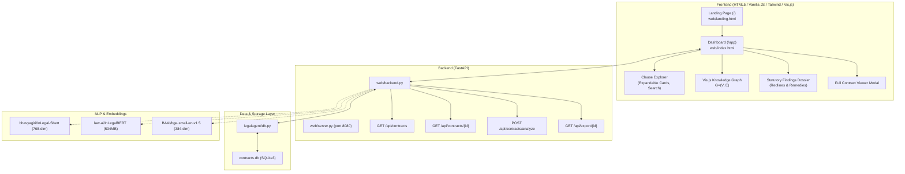

# LegalAgent — Project Context & Architecture

## 1. Overview & Objective

**LegalAgent** is an intelligent contract review and risk detection system built specifically for **Indian commercial contracts**. 

Traditional legaltech platforms analyze contract clauses in isolation. LegalAgent maps clause interdependencies into an **attributed knowledge graph** $G=(V, E)$, detects **cross-clause contradictions** (e.g., an aggregate liability cap nullified by an uncapped indemnity clause), and evaluates enforceability against **Indian statutory law** (e.g., Section 27 Indian Contract Act voiding non-competes, Section 74 liquidated damages vs penalties, DPDPA 2023 affirmative consent, BNS 2023 criminal statute references).

### Short-Term Objective
Create an executive-grade prototype and interactive assessment demo showcasing:
1. Editorial landing page explaining the platform purpose, Indian law focus, and pipeline.
2. Interactive 3-panel workspace: Clause Explorer, Attributed Graph Canvas, and Statutory Findings & Risk Audit.
3. Live SQLite3 persistence with real Indian contract scenarios (IT MSA, Executive NDA, Vendor Supply, and Synthetic Lorem Ipsum).

---

## 2. System Architecture

---

## 3. Core Components

### 3.1 Web Frontend (`web/`)
- **`web/landing.html`**:
  - Classy legaltech landing page modeled after modern legal consulting and enterprise legaltech platforms.
  - Sections: Hero with CTA, key capability cards (Cross-Clause Graph, Indian Compliance, Contradiction Detection, Legal NLP, Risk Topology, Audit Memos), 4-stage pipeline explanation, Indian statutes breakdown, tech stack pills, and responsive layout with scroll-reveal animations.
- **`web/index.html`**:
  - 3-panel resizable workspace (draggable dividers between Clause Explorer, Network Graph, and Findings Dossier).
  - Palette: Deep Navy (`#1a2332`), Warm Ivory (`#f5f3ef`), Off-White (`#fafaf8`), Copper/Muted Gold (`#9a7b4f`), and desaturated risk tones. No neon, no glow, no `§` symbol.
  - Typography: `Playfair Display` serif for headings, `Inter` for UI/body text, `JetBrains Mono` for IDs/data.
  - Interactive features:
    - **Clause Cards**: Expandable with "Read more / Show less" toggles, category badges, click-to-focus on graph.
    - **"View Full" Button & Modal**: Renders the complete contract sequentially for seamless reading.
    - **Interactive Graph**: Powered by Vis.js with tuned physics (`gravitationalConstant: -8000`, `springLength: 250`, `avoidOverlap: 0.6`) preventing node bundle overlap.
    - **Edge-to-Finding Click Linking**: Clicking an edge in the graph scrolls to and highlights the corresponding finding card in the right panel with an auto-fading copper ring.
    - **Export Audit Modal**: Formats an executive legal memorandum with citations and proposed redlines for clipboard copy.
    - **Upload / Custom Analyze Modal**: Ingests custom pasted text and performs automated statutory audits.

### 3.2 Backend Service (`web/backend.py`, `web/server.py`)
- **FastAPI REST application** running on port 8080.
- Serves `landing.html` at `/` and `index.html` at `/app`.
- Endpoints:
  - `GET /api/contracts`: Returns contract summaries, clause counts, edge counts, critical risk counts, and computed health scores.
  - `GET /api/contracts/{id}`: Returns complete graph JSON (clauses, edges, findings, contract metadata).
  - `POST /api/contracts/analyze`: Parses custom contract text into clauses, detects uncapped indemnity vs liability cap conflicts, identifies Section 27 ICA non-competes, and writes nodes/edges to SQLite.
  - `GET /api/export/{id}`: Exports an executive audit memo formatted in Markdown.

### 3.3 Database Layer (`legalagent/db.py`, `contracts.db`)
- **SQLite3 database** with 4 tables:
  1. `contracts`: Metadata, jurisdiction, title, category, health scores.
  2. `clauses`: Clause ID, title, text, tag, clause number, ordinal.
  3. `graph_edges`: Source, target, relation type (`conflict`, `statutory`, `xref`, `semantic`), severity, color, dashes.
  4. `findings`: Finding title, severity, relation type, source clause ref, target clause ref, legal rationale, statutory citations, remedy suggestion.
- **Seeded Datasets**:
  - `tech_msa`: 12 clauses, 8 edges, 3 findings (Limitation of liability vs uncapped indemnity, DPDPA compliance).
  - `employment_nda`: 7 clauses, 3 edges, 1 finding (Post-termination non-compete void under Section 27 Indian Contract Act).
  - `vendor_supply`: 5 clauses, 2 edges, 2 findings (Unreasonable penalty clause under Section 74 Indian Contract Act).
  - `lorem_ipsum_demo`: 7 clauses, 5 edges, 2 findings (Synthetic test instrument for panel demonstration).

### 3.4 ML Models & Environments
- Virtual Environment: `/home/aryan/Projects/LegalAgent/LegalAgent/venv` (Python 3.12, PyTorch, Transformers, Sentence-Transformers, scikit-learn, rank-bm25, FastAPI, uvicorn).
- Downloaded models in HuggingFace cache:
  - `bhavyagiri/InLegal-Sbert`: 768-dim embeddings tuned on Indian court judgments.
  - `BAAI/bge-small-en-v1.5`: Fast 384-dim general dense retrieval model.
  - `law-ai/InLegalBERT`: 534MB masked language model for Indian legal text.

---

## 4. Indian Statutory Rules Encoded

1. **Indian Contract Act, 1872**:
   - **Section 27**: Every agreement restraining trade/profession is void *ab initio*. Post-termination non-competes in employment/service contracts are void, irrespective of reasonableness (*Percept D'Mark v. Zaheer Khan*).
   - **Sections 73 & 74**: Unreasonable pre-stipulated penalty clauses are unenforceable; courts grant only reasonable compensation for actual proven damages (*Fateh Chand v. Balkishan Dass*, *Kailash Nath v. DDA*).
   - **Sections 124 & 125**: Contracts of indemnity constitute independent rights of action; silent or ambiguous liability caps clashing with uncapped indemnities create immediate exposure.
2. **Digital Personal Data Protection Act, 2023 (DPDPA)**:
   - Mandatory notice and affirmative consent for processing personal data; ambiguous consent clauses or broad processing warranties violate DPDPA.
3. **Bharatiya Nyaya Sanhita, 2023 (BNS)**:
   - Replaced IPC 1860 effective 1 July 2024. Contracts referencing repealed IPC provisions (e.g., Section 420 Cheating) must reference BNS equivalents (Section 318).
4. **Mediation Act, 2023**:
   - Mandatory pre-litigation mediation framework for commercial disputes.

