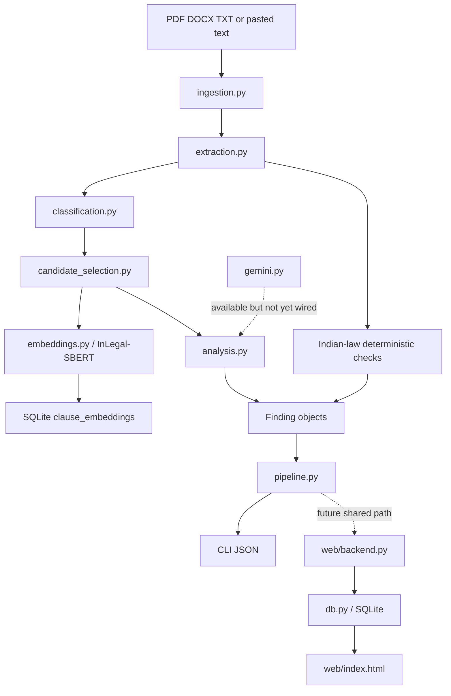

# LegalAgent Current Context

## Product Objective

LegalAgent is an assistive Indian contract-review system. Its distinctive unit of analysis is the relationship between clauses, not only an isolated clause.

```text
Indian contract
  -> normalized text
  -> extracted clauses and cross-references
  -> clause labels
  -> related-clause retrieval
  -> cross-clause conflict/dependency analysis
  -> Indian-law grounding
  -> evidence-backed findings and graph
```

The system is a research/demo prototype and is not legal advice.

## Architecture



## File Responsibilities

### `legalagent/core/ingestion.py`

Loads TXT, DOCX, and PDF. PDF extraction uses PyMuPDF. If native PDF text is too short, PyMuPDF calls Tesseract OCR. `normalize()` creates the canonical text used by all evidence offsets.

### `legalagent/core/extraction.py`

Uses regular expressions to find decimal numbered clauses and references such as `Section 8.2`. It creates stable clause IDs and protects against repeated section-number collisions.

### `legalagent/core/types.py`

Defines the internal contracts between stages:

- `Clause`: extracted text, offsets, labels, references.
- `Finding`: relationship type, severity, rationale, evidence, sources, scores.
- `Run`: configuration and counts.

### `legalagent/core/classification.py`

Keyword baseline. It identifies labels such as indemnification, liability limitation, termination, survival, confidentiality, assignment, warranty, and governing law.

### `legalagent/core/candidate_selection.py`

Builds the shortlist using explicit cross-references, risky label combinations in `TYPE_MATRIX`, BM25 lexical similarity, and optional dense InLegal-SBERT similarity. The candidate cap is currently 30 pairs.

### `legalagent/core/embeddings.py`

Loads the model lazily and caches it:

```python
@lru_cache(maxsize=2)
def load_model(model_name="bhavyagiri/InLegal-Sbert"):
    from sentence_transformers import SentenceTransformer
    return SentenceTransformer(model_name)
```

It calls:

```python
model.encode(texts, normalize_embeddings=True)
```

`related_pairs()` computes cosine similarity using the dot product of normalized vectors. The default model creates 768-dimensional vectors. The web API stores these vectors in the `clause_embeddings` SQLite table.

### `legalagent/core/analysis.py`

Current deterministic findings:

- Liability cap versus indemnity conflict.
- Termination/survival dependency.
- Post-termination non-compete under Indian Contract Act Section 27.

`validate_findings()` ensures all referenced clauses exist and evidence slices are non-empty.

### `legalagent/core/gemini.py`

Loads `.env`, lists available Gemini generation models, selects a valid configured/Flash model, and can request JSON output. A minimal request has been verified. Main pipeline integration remains pending.

### `legalagent/core/pipeline.py`

Orchestrates:

```text
ingest -> extract -> classify -> select_candidates -> analyse -> validate -> Run
```

The CLI uses this path.

### `legalagent/db.py`

Owns SQLite setup, seeded contracts, graph records, findings, and embedding persistence. The schema includes `contracts`, `clauses`, `graph_edges`, `findings`, and `clause_embeddings`.

### `web/backend.py`

FastAPI API and environment loading. It serves seeded dashboard data, custom text analysis, audit export, and embedding projection. Its custom analysis implementation is not yet unified with `core.pipeline.py`.

### `web/index.html`

Visual dashboard with clause cards, Vis.js graph, risk findings, pipeline-stage graph, and 2D embedding graph.

## Data and Tests

- Official Indian PPP contract source metadata: `data/demo/india/official/SOURCES.md`.
- Synthetic planted-irregularity benchmark: `data/demo/india/custom_benchmark/`.
- PDF-to-Markdown: `scripts/pdf_to_markdown.py`.
- Adversarial Markdown/PDF injection scripts are currently untracked and should be reviewed before committing.
- Tests: `tests/test_pipeline.py`.
- Architecture guide: `ARCHITECTURE_FLOW.md`.
- Status and future plan: `UPDATE.md`.

## Known Error and Review Points

No specific traceback was present in the latest context. When diagnosing an error, record:

1. Exact command.
2. Complete traceback.
3. Input file and whether it is native-text or scanned PDF.
4. Python interpreter path.
5. Whether the failure occurs in CLI, API, OCR, SBERT loading, or Gemini.

Common causes:

- Using system Python instead of `venv/bin/python`.
- Missing PyMuPDF, Tesseract, or model dependencies.
- Scanned PDF with OCR noise.
- Clause numbers not matching the extractor regex.
- Gemini model unavailable for the API key.
- `.env` not loaded or key accidentally exposed.

## Next Steps

1. Review and commit the adversarial Markdown workflow after its output is validated.
2. Unify web custom analysis with the core pipeline.
3. Build a targeted Indian statute/judgment retrieval index; do not download the entire legal corpus yet.
4. Wire Gemini into pair analysis with schema and evidence validation.
5. Add integration tests and benchmark metrics.
6. Collect labelled Indian clause pairs before considering SBERT fine-tuning.
