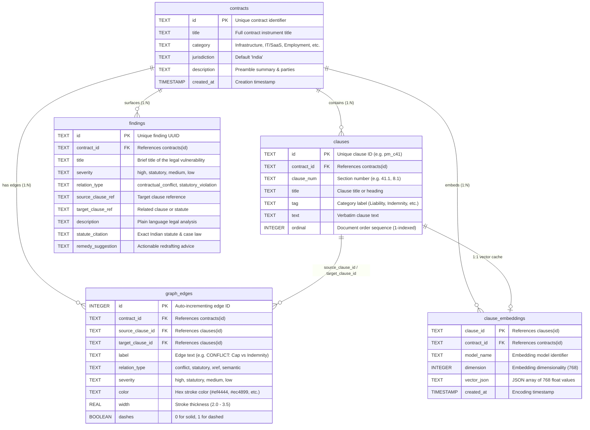

# LegalAgent — SQLite Database Schema (`contracts.db`)

This document provides the complete structural specification for `contracts.db`, the relational knowledge-graph store backing LegalAgent's core engine, REST API, and interactive dashboard.

The database is managed and initialized via [`legalagent/db.py`](../../../legalagent/db.py).

---

## 1. Entity-Relationship Overview



---

## 2. Table Specifications

### 2.1 Table: `contracts`
Stores metadata for each analyzed or seeded contract agreement.

```sql
CREATE TABLE IF NOT EXISTS contracts (
    id TEXT PRIMARY KEY,
    title TEXT NOT NULL,
    category TEXT NOT NULL,
    jurisdiction TEXT DEFAULT 'India',
    description TEXT,
    created_at TIMESTAMP DEFAULT CURRENT_TIMESTAMP
);
```

| Column | Type | Constraints | Description & Example |
|---|---|---|---|
| `id` | `TEXT` | `PRIMARY KEY` | Unique slug: `'pune_metro_2019'`, `'tech_msa_01'`, `'custom_a1b2c3'`. |
| `title` | `TEXT` | `NOT NULL` | Formal title: `'Pune Metro Line III — PPP Concession Agreement (2019)'`. |
| `category` | `TEXT` | `NOT NULL` | Contract domain: `'Infrastructure PPP'`, `'IT / SaaS Services'`, `'Employment'`. |
| `jurisdiction` | `TEXT` | `DEFAULT 'India'` | Governing jurisdiction governing statutory audit. |
| `description` | `TEXT` | `NULLABLE` | Preamble summary, corporate parties, and execution date. |
| `created_at` | `TIMESTAMP`| `DEFAULT CURRENT_TIMESTAMP` | Ingestion timestamp. |

---

### 2.2 Table: `clauses`
Represents the vertices ($V$) of the contract knowledge graph $G=(V, E)$. Every extracted clause is stored with its verbatim text, heading, category tag, and ordinal sequence.

```sql
CREATE TABLE IF NOT EXISTS clauses (
    id TEXT PRIMARY KEY,
    contract_id TEXT NOT NULL,
    clause_num TEXT NOT NULL,
    title TEXT NOT NULL,
    tag TEXT NOT NULL,
    text TEXT NOT NULL,
    ordinal INTEGER NOT NULL,
    FOREIGN KEY (contract_id) REFERENCES contracts(id) ON DELETE CASCADE
);
```

| Column | Type | Constraints | Description & Example |
|---|---|---|---|
| `id` | `TEXT` | `PRIMARY KEY` | Canonical ID: `'pm_c41'`, `'msa_c8_1'`. |
| `contract_id` | `TEXT` | `NOT NULL, FK → contracts(id)` | Parent contract link with cascade delete. |
| `clause_num` | `TEXT` | `NOT NULL` | Section number: `'41.1'`, `'8.1'`, `'91.3'`. |
| `title` | `TEXT` | `NOT NULL` | Clause title: `'Limitation of Liability'`, `'Indemnification'`. |
| `tag` | `TEXT` | `NOT NULL` | Functional category: `'Liability'`, `'Indemnity'`, `'High Risk'`, `'General'`. |
| `text` | `TEXT` | `NOT NULL` | Verbatim text of the clause. |
| `ordinal` | `INTEGER`| `NOT NULL` | 1-indexed document sequence order. |

---

### 2.3 Table: `graph_edges`
Represents the directed typed relationships ($E$) between clauses in $G=(V, E)$. These power the interactive Vis.js network visualization in the dashboard.

```sql
CREATE TABLE IF NOT EXISTS graph_edges (
    id INTEGER PRIMARY KEY AUTOINCREMENT,
    contract_id TEXT NOT NULL,
    source_clause_id TEXT NOT NULL,
    target_clause_id TEXT NOT NULL,
    label TEXT NOT NULL,
    relation_type TEXT NOT NULL, -- conflict, statutory, xref, semantic
    severity TEXT DEFAULT 'medium', -- high, statutory, medium, low
    color TEXT NOT NULL,
    width REAL DEFAULT 2.0,
    dashes BOOLEAN DEFAULT 0,
    FOREIGN KEY (contract_id) REFERENCES contracts(id) ON DELETE CASCADE,
    FOREIGN KEY (source_clause_id) REFERENCES clauses(id) ON DELETE CASCADE,
    FOREIGN KEY (target_clause_id) REFERENCES clauses(id) ON DELETE CASCADE
);
```

| Column | Type | Constraints | Description & Example |
|---|---|---|---|
| `id` | `INTEGER` | `PRIMARY KEY AUTOINCREMENT` | Unique edge ID. |
| `contract_id` | `TEXT` | `NOT NULL, FK → contracts(id)` | Parent contract link. |
| `source_clause_id`| `TEXT` | `NOT NULL, FK → clauses(id)` | Starting vertex (e.g. Liability clause). |
| `target_clause_id`| `TEXT` | `NOT NULL, FK → clauses(id)` | Terminating vertex (e.g. Indemnity clause). |
| `label` | `TEXT` | `NOT NULL` | Edge canvas label: `'CONFLICT: Cap vs Indemnity'`, `'STATUTORY VOID: Sec 27 ICA'`. |
| `relation_type` | `TEXT` | `NOT NULL` | Edge taxonomy: `'conflict'`, `'statutory'`, `'xref'`, `'semantic'`. |
| `severity` | `TEXT` | `DEFAULT 'medium'` | Risk level: `'high'`, `'statutory'`, `'medium'`, `'low'`. |
| `color` | `TEXT` | `NOT NULL` | Canvas color: Red (`#ef4444`), Purple (`#ec4899`), Blue (`#0ea5e9`), Green (`#10b981`). |
| `width` | `REAL` | `DEFAULT 2.0` | Line thickness on canvas (2.0 to 3.5). |
| `dashes` | `BOOLEAN` | `DEFAULT 0` | `0` for solid lines (direct conflicts); `1` for dashed (sequential/semantic). |

---

### 2.4 Table: `findings`
Stores actionable legal risk findings, statutory citations, and suggested remedies for review panels and legal counsels.

```sql
CREATE TABLE IF NOT EXISTS findings (
    id TEXT PRIMARY KEY,
    contract_id TEXT NOT NULL,
    title TEXT NOT NULL,
    severity TEXT NOT NULL, -- high, statutory, medium, low
    relation_type TEXT NOT NULL,
    source_clause_ref TEXT NOT NULL,
    target_clause_ref TEXT NOT NULL,
    description TEXT NOT NULL,
    statute_citation TEXT,
    remedy_suggestion TEXT,
    FOREIGN KEY (contract_id) REFERENCES contracts(id) ON DELETE CASCADE
);
```

| Column | Type | Constraints | Description & Example |
|---|---|---|---|
| `id` | `TEXT` | `PRIMARY KEY` | UUID: `'finding_7c1e3a9b'`. |
| `contract_id` | `TEXT` | `NOT NULL, FK → contracts(id)` | Parent contract link. |
| `title` | `TEXT` | `NOT NULL` | Finding headline: `'Post-Termination Non-Compete is Void Ab Initio'`. |
| `severity` | `TEXT` | `NOT NULL` | Severity tier: `'high'`, `'statutory'`, `'medium'`, `'low'`. |
| `relation_type` | `TEXT` | `NOT NULL` | Vulnerability type: `'statutory_violation'`, `'contractual_conflict'`. |
| `source_clause_ref`| `TEXT`| `NOT NULL` | Primary offending clause: `'Clause 91.3 (Non-Compete)'`. |
| `target_clause_ref`| `TEXT`| `NOT NULL` | Conflicting clause or governing statute: `'Section 27, ICA 1872'`. |
| `description` | `TEXT` | `NOT NULL` | Plain-language risk analysis. |
| `statute_citation` | `TEXT` | `NULLABLE` | Statutory authority: `'Section 27 ICA & Percept D''Mark v. Zaheer Khan (2006)'`. |
| `remedy_suggestion`| `TEXT` | `NULLABLE` | Actionable redrafting recommendation. |

---

### 2.5 Table: `clause_embeddings`
Stores pre-computed InLegal-SBERT vector embeddings for instantaneous 2D cluster projection and semantic retrieval without re-encoding on every request.

```sql
CREATE TABLE IF NOT EXISTS clause_embeddings (
    clause_id TEXT PRIMARY KEY,
    contract_id TEXT NOT NULL,
    model_name TEXT NOT NULL,
    dimension INTEGER NOT NULL,
    vector_json TEXT NOT NULL,
    created_at TIMESTAMP DEFAULT CURRENT_TIMESTAMP,
    FOREIGN KEY (contract_id) REFERENCES contracts(id) ON DELETE CASCADE,
    FOREIGN KEY (clause_id) REFERENCES clauses(id) ON DELETE CASCADE
);
```

| Column | Type | Constraints | Description & Example |
|---|---|---|---|
| `clause_id` | `TEXT` | `PRIMARY KEY, FK → clauses(id)` | 1:1 link to parent clause. |
| `contract_id` | `TEXT` | `NOT NULL, FK → contracts(id)` | Parent contract link. |
| `model_name` | `TEXT` | `NOT NULL` | Model identifier: `'bhavyagiri/InLegal-Sbert'`. |
| `dimension` | `INTEGER`| `NOT NULL` | Vector length: `768`. |
| `vector_json` | `TEXT` | `NOT NULL` | JSON string of the 768-d float vector `[0.0142, -0.0531, ...]`. |
| `created_at` | `TIMESTAMP`| `DEFAULT CURRENT_TIMESTAMP` | Encoding timestamp. |

---

## 3. Useful SQLite Operations

### Reset and Re-seed the Database:
```bash
venv/bin/python -c "from legalagent.db import init_db, seed_database; init_db(); seed_database()"
```

### Inspect Stored Contracts:
```bash
sqlite3 contracts.db "SELECT id, title, category FROM contracts;"
```

### Query All Critical Risk Findings for a Contract:
```bash
sqlite3 contracts.db "
SELECT title, severity, statute_citation 
FROM findings 
WHERE contract_id = 'pune_metro_2019' AND severity IN ('high', 'statutory');"
```

### Query Graph Edges for Canvas Rendering:
```bash
sqlite3 contracts.db "
SELECT source_clause_id, target_clause_id, label, color 
FROM graph_edges 
WHERE contract_id = 'pune_metro_2019';"
```
